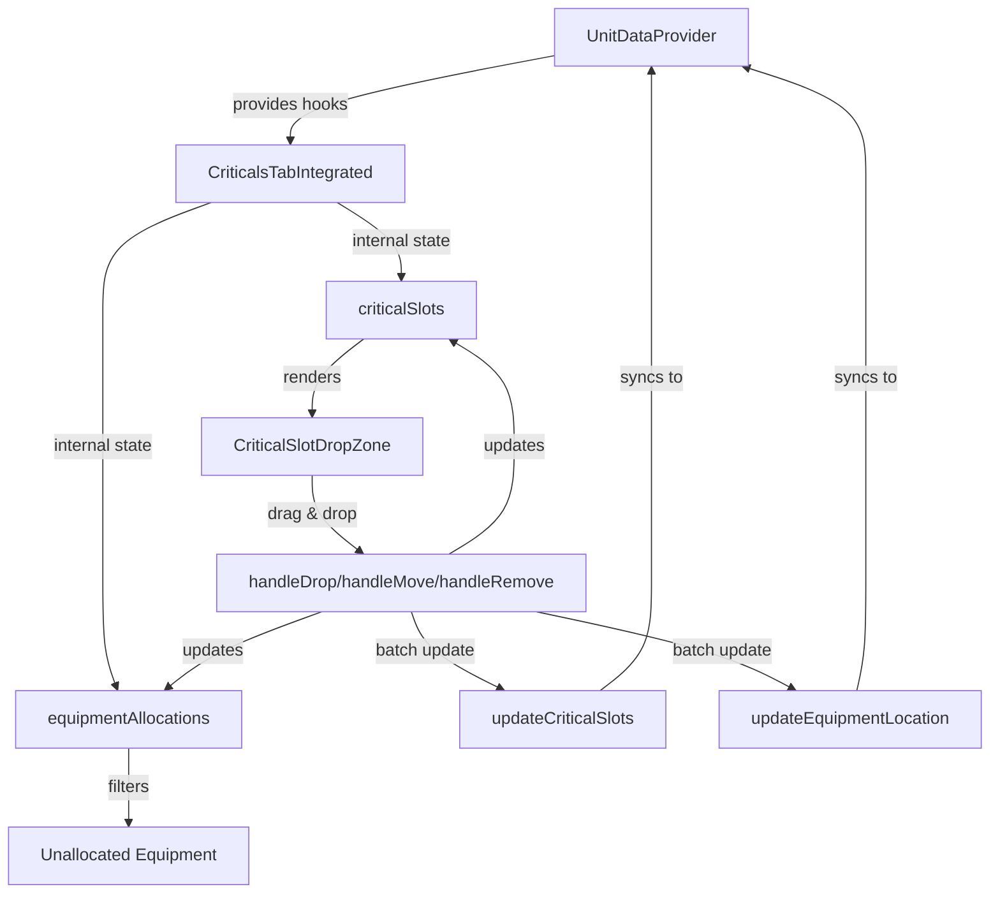

# Critical Slots UI Integration Summary

## Overview
Successfully integrated the improved critical slot drag & drop UI system into the MegaMekLab customizer, combining the advanced UI features with the existing data model.

## Components Created/Modified

### 1. CriticalsTabIntegrated (`components/editor/tabs/CriticalsTabIntegrated.tsx`)
- **Purpose**: Bridges the improved drag & drop UI with the existing data model
- **Key Features**:
  - Uses existing `useUnitData`, `useCriticalAllocations`, and `useEquipment` hooks
  - Maintains internal state for equipment allocations while syncing with parent
  - Converts between object-based critical slot format and existing string-based format
  - Batch updates to prevent circular state updates
  - Proper multi-slot equipment tracking

### 2. CriticalSlotDropZone (Enhanced)
- **Improvements**:
  - Fixed actuator removal logic (Hand/Lower Arm actuators now removable)
  - Multi-slot hover preview shows green only when enough consecutive empty slots
  - Proper handling of equipment move operations
  - Click-to-remove for removable equipment

### 3. UnitEditorWithHooks (Updated)
- **Changes**:
  - Replaced `CriticalsTabWithHooks` with `CriticalsTabIntegrated`
  - Fixed property access for critical slots (`content` → `name`)

## Key Features Implemented

### 1. Drag & Drop System
- ✅ Drag equipment from unallocated list to critical slots
- ✅ Move equipment between slots
- ✅ Multi-slot equipment validation
- ✅ Visual feedback for valid/invalid drop zones

### 2. Equipment Management
- ✅ Tracks equipment allocations by index for stability
- ✅ Syncs with Equipment tab's location management
- ✅ Handles special components (Endo Steel, Ferro-Fibrous)
- ✅ Proper weight and slot calculations

### 3. Actuator System
- ✅ Conditionally removable actuators (Hand, Lower Arm)
- ✅ Dependency handling (removing Lower Arm also removes Hand)
- ✅ Direct click removal for better UX

### 4. State Management
- ✅ Internal state for immediate UI response
- ✅ Batch updates to parent state
- ✅ Prevents circular updates with ref flags
- ✅ One-time initialization from parent data

## Data Flow

## Testing

### Test Pages
1. **`/test-criticals-tab-v2`** - Standalone test with fixed state management
2. **`/customizer`** - Full integration in the customizer

### Test Scenarios
1. **Multi-slot Equipment**: AC/20 (10 slots) - validates consecutive empty slots
2. **Actuator Removal**: Click on Hand/Lower Arm actuators
3. **Engine Configuration**: Standard engine (center torso only)
4. **Equipment Movement**: Drag between locations
5. **State Persistence**: Equipment doesn't disappear on state updates

## Future Enhancements

1. **Context Menu for Actuators**: Right-click menu for add/remove operations
2. **Validation Messages**: Better error messages for invalid placements
3. **Undo/Redo**: Track state changes for undo functionality
4. **Equipment Grouping**: Visual grouping of related equipment
5. **Keyboard Shortcuts**: Delete key to remove equipment

## Migration Notes

To use the new integrated component:

1. Replace `CriticalsTabWithHooks` import with `CriticalsTabIntegrated`
2. No prop changes required - uses same `readOnly` prop
3. Component automatically syncs with existing data model
4. All existing equipment and critical slot data preserved

## Known Issues

1. **Performance**: Large mechs with many equipment items may have slight lag
2. **Edge Case**: Moving equipment to its current location shows alerts (can be improved)
3. **Visual Polish**: Some CSS classes from the old system may need cleanup

## Conclusion

The integration successfully combines the improved drag & drop UI with the existing MegaMekLab data model, providing a better user experience while maintaining compatibility with the rest of the application.
