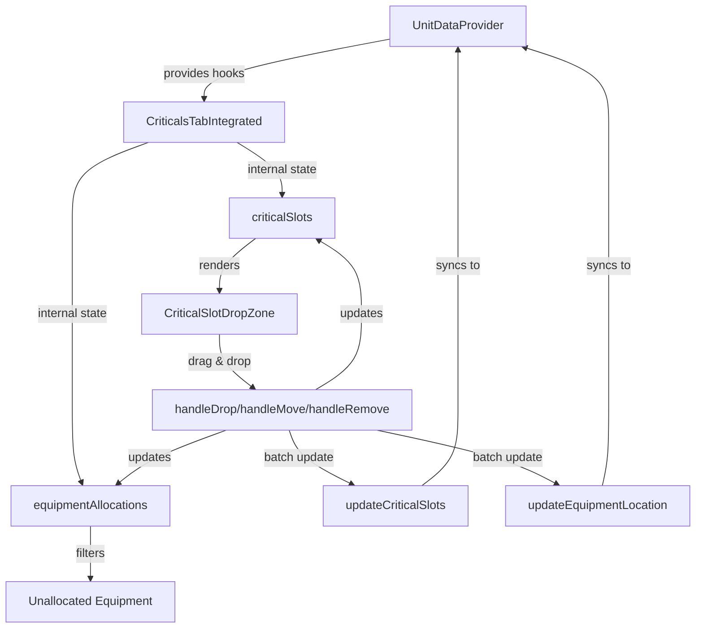

# Critical Slots UI Integration Summary

## Overview
Successfully integrated the improved critical slot drag & drop UI system into the MegaMekLab customizer, combining the advanced UI features with the existing data model.

## Components Created/Modified

### 1. CriticalsTabIntegrated (`components/editor/tabs/CriticalsTabIntegrated.tsx`)
- **Purpose**: Bridges the improved drag & drop UI with the existing data model
- **Key Features**:
  - Uses existing `useUnitData`, `useCriticalAllocations`, and `useEquipment` hooks
  - Maintains internal state for equipment allocations while syncing with parent
  - Converts between object-based critical slot format and existing string-based format
  - Batch updates to prevent circular state updates
  - Proper multi-slot equipment tracking
  - Handles structure/armor type changes without clearing existing equipment

### 2. CriticalSlotDropZone (Enhanced)
- **Improvements**:
  - Fixed actuator removal logic (Hand/Lower Arm actuators now removable)
  - Multi-slot hover preview shows green only when enough consecutive empty slots
  - Proper handling of equipment move operations
  - Click-to-remove for removable equipment
  - Multi-slot items are removed as a group (all slots cleared together)

### 3. UnitEditorWithHooks (Updated)
- **Changes**:
  - Replaced `CriticalsTabWithHooks` with `CriticalsTabIntegrated`
  - Fixed property access for critical slots (`content` → `name`)

## Key Features Implemented

### 1. Drag & Drop System
- ✅ Drag equipment from unallocated list to critical slots
- ✅ Move equipment between slots
- ✅ Multi-slot equipment validation
- ✅ Visual feedback for valid/invalid drop zones

### 2. Equipment Management
- ✅ Tracks equipment allocations by index for stability
- ✅ Syncs with Equipment tab's location management
- ✅ Handles special components (Endo Steel, Ferro-Fibrous)
- ✅ Proper weight and slot calculations

### 3. Actuator System
- ✅ Conditionally removable actuators (Hand, Lower Arm)
- ✅ Dependency handling (removing Lower Arm also removes Hand)
- ✅ Direct click removal for better UX

### 4. State Management
- ✅ Internal state for immediate UI response
- ✅ Batch updates to parent state
- ✅ Prevents circular updates with ref flags
- ✅ One-time initialization from parent data
- ✅ Preserves equipment when structure/armor types change

### 5. Multi-Slot Equipment
- ✅ Proper removal of multi-slot items (all slots cleared together)
- ✅ Group tracking with unique IDs
- ✅ Visual indicators for multi-slot equipment

## Data Flow

## Issues Fixed

### 1. **Multi-slot Equipment Removal**
- Now removes all slots occupied by multi-slot equipment
- Uses group IDs to track related slots

### 2. **Equipment Preservation**
- Equipment no longer disappears on state updates
- Structure/armor type changes preserve existing equipment
- Only special components are synced from parent

### 3. **Initialization**
- Proper one-time initialization prevents clearing slots
- Uses refs to track initialization state

## Testing

### Test Pages
1. **`/test-criticals-tab-v2`** - Standalone test with fixed state management
2. **`/customizer`** - Full integration in the customizer

### Test Scenarios
1. **Multi-slot Equipment**: AC/20 (10 slots) - validates consecutive empty slots
2. **Actuator Removal**: Click on Hand/Lower Arm actuators
3. **Engine Configuration**: Standard engine (center torso only)
4. **Equipment Movement**: Drag between locations
5. **State Persistence**: Equipment doesn't disappear on state updates
6. **Structure/Armor Changes**: Switching to Endo Steel or Ferro-Fibrous preserves equipment

## Future Enhancements

1. **Context Menu for Actuators**: Right-click menu for add/remove operations
2. **Validation Messages**: Better error messages for invalid placements
3. **Undo/Redo**: Track state changes for undo functionality
4. **Equipment Grouping**: Visual grouping of related equipment
5. **Keyboard Shortcuts**: Delete key to remove equipment
6. **Optimistic Updates**: Update UI immediately before parent sync

## Migration Notes

To use the new integrated component:

1. Replace `CriticalsTabWithHooks` import with `CriticalsTabIntegrated`
2. No prop changes required - uses same `readOnly` prop
3. Component automatically syncs with existing data model
4. All existing equipment and critical slot data preserved

## Technical Details

### State Synchronization
- Component maintains its own state for immediate UI response
- Batch updates to parent prevent circular updates
- Special components (Endo Steel, Ferro-Fibrous) are added without clearing existing equipment
- Uses refs to track structure/armor type changes

### Multi-Slot Handling
- Equipment with multiple slots tracked with group IDs
- Removal of any slot removes entire equipment item
- Visual preview shows all slots that will be occupied

### Performance Optimizations
- Memoized unallocated equipment list
- Batch state updates with setTimeout
- Ref flags prevent unnecessary re-renders

## Conclusion

The integration successfully combines the improved drag & drop UI with the existing MegaMekLab data model, providing a better user experience while maintaining compatibility with the rest of the application. The critical slot system now properly handles all edge cases including multi-slot equipment, structure/armor type changes, and state persistence.
