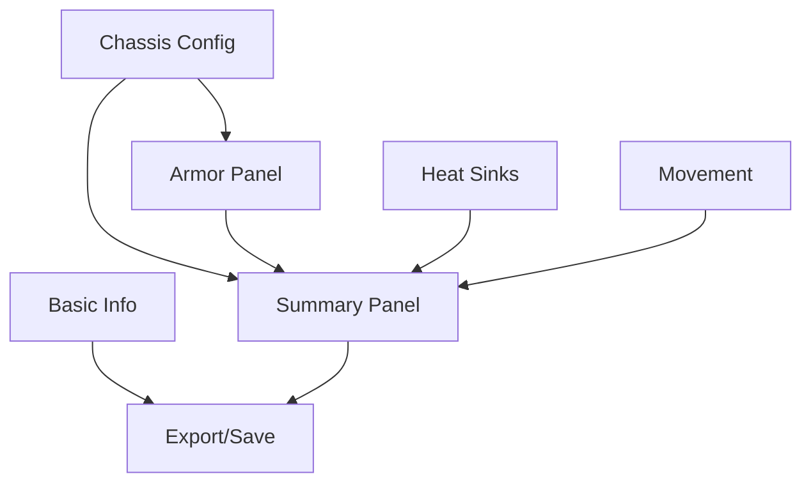

# MegaMekLab Armor Diagram Setup - Detailed Implementation Plan

## Overview
Based on the MegaMekLab screenshots, the armor setup is integrated into the Structure/Armor tab, which contains multiple panels for comprehensive unit configuration.

## Component Breakdown

### 1. Basic Information Panel (Top Left)
**Purpose**: Core unit identification and metadata
**Components**:
- Chassis name input field
- Clan name input field  
- Model input field
- MUL ID field with format validation (-1 or numeric)
- Year selector (e.g., 3145)
- Source/Era dropdown
- Tech Base dropdown (Inner Sphere, Clan, Mixed)
- Tech Level dropdown (Standard, Advanced, Experimental)
- Manual BV input field
- Role dropdown
- Icon management section:
  - Choose file button
  - Import from cache button
  - Remove button
  - Icon preview area

**Implementation Priority**: Medium (mostly metadata)

### 2. Chassis Configuration Panel (Bottom Left)
**Purpose**: Core chassis settings
**Components**:
- Tonnage spinner (5-200 tons)
- Omni checkbox
- Base Type dropdown (Standard, Primitive)
- Motive Type dropdown (Biped, Quad, Tripod, LAM)
- Structure dropdown (Standard, Endo Steel, etc.)
- Engine dropdown (Fusion, XL, Light, etc.)
- Gyro dropdown (Standard, XL, Compact, Heavy Duty)
- Cockpit dropdown (Standard, Small, Command Console, etc.)
- Enhancement dropdown (None, TSM, MASC, etc.)

**Implementation Priority**: High (affects armor calculations)

### 3. Heat Sinks Panel (Middle Top)
**Purpose**: Heat management configuration
**Components**:
- Type dropdown (Single/Double)
- Number input with up/down arrows
- Engine Free indicator (shows free slots from engine rating)
- Weight Free display
- Total Dissipation calculation
- Total Equipment Heat display

**Implementation Priority**: Medium

### 4. Movement Panel (Middle Bottom)
**Purpose**: Movement point configuration
**Components**:
- Walk MP input with Base/Final columns
- Run MP display (calculated)
- Jump/UMU MP input
- Jump Type dropdown (Jump Jet, UMU, Mechanical Jump Booster)
- Mech. J. Booster MP field

**Implementation Priority**: Medium

### 5. Summary Panel (Center)
**Purpose**: Weight and critical slot tracking
**Components**:
- Unit Type display
- Component breakdown table:
  - Structure (weight/crits)
  - Engine (weight/crits)
  - Gyro (weight/crits)
  - Cockpit (weight/crits)
  - Heatsinks (crits only)
  - Armor (crits only)
  - Jump Jets (crits only)
  - Equipment section
  - Myomer section
  - Other section
- Availability ratings (D/C-E-D-C format)
- Earliest Possible Year calculation

**Implementation Priority**: High (validation feedback)

### 6. Armor Panel (Right) - PRIMARY FOCUS
**Purpose**: Armor allocation and management
**Components**:

#### 6.1 Armor Configuration
- Armor Type dropdown:
  - Standard
  - Ferro-Fibrous
  - Light Ferro-Fibrous
  - Heavy Ferro-Fibrous
  - Stealth
  - Reactive
  - Reflective
  - Hardened
  - Ferro-Lamellor
  - Primitive
  - Patchwork
- Armor Tonnage input with arrows
- Maximize Armor button
- Use Remaining Tonnage button

#### 6.2 Armor Allocation Grid
- Location-based inputs:
  - HD (Head): Single value, Max shown
  - LA (Left Arm): Single value, Max shown
  - LT (Left Torso): Front/Rear values, Max shown
  - CT (Center Torso): Front/Rear values, Max shown
  - RT (Right Torso): Front/Rear values, Max shown
  - RA (Right Arm): Single value, Max shown
  - LL (Left Leg): Single value, Max shown
  - RL (Right Leg): Single value, Max shown
- Visual grouping (Arms/Torsos/Legs)
- Max values displayed for each location

#### 6.3 Armor Statistics
- Unallocated Armor Points
- Allocated Armor Points
- Total Armor Points
- Maximum Possible Armor Points
- Wasted Armor Points
- Points Per Ton display

#### 6.4 Auto-Allocation
- Auto-Allocate Armor button
- Algorithm (from previous analysis):
  - Head: 5x base percentage (max 9 or 12)
  - Torsos: 75/25 front/rear split
  - Symmetric allocation for paired locations
  - Smart leftover distribution

**Implementation Priority**: CRITICAL

## Technical Implementation Plan

### Phase 1: Core Armor Components (Already Completed)
✅ ArmorAllocationPanel base structure
✅ Location-based armor inputs
✅ Auto-allocation algorithm
✅ Patchwork armor support

### Phase 2: Integration Components (To Do)
1. **Chassis Integration**
   - Link tonnage to max armor calculations
   - Update structure type effects on armor
   - Handle motive type changes (Biped/Quad/Tripod)

2. **Summary Panel Integration**
   - Real-time weight tracking
   - Critical slot usage display
   - Availability calculation

3. **Advanced Armor Types**
   - Implement all armor type calculations
   - Handle special rules (Stealth, Reactive, etc.)
   - Critical slot requirements per type

### Phase 3: UI Polish
1. **Visual Enhancements**
   - Match MegaMekLab's layout exactly
   - Add visual separators between sections
   - Implement proper spacing and alignment

2. **Validation Feedback**
   - Red highlighting for overweight
   - Yellow warnings for suboptimal configs
   - Green indicators for valid setups

### Phase 4: Additional Features
1. **Icon Management**
   - File upload for custom icons
   - Icon cache system
   - Preview display

2. **Export/Import**
   - Save configurations
   - Load from templates
   - MegaMekLab file compatibility

## Component Dependencies



## State Management

```typescript
interface StructureArmorTabState {
  basicInfo: {
    chassis: string;
    clanName?: string;
    model: string;
    mulId: string;
    year: number;
    sourceEra: string;
    techBase: string;
    techLevel: string;
    manualBV?: number;
    role: string;
    icon?: string;
  };
  
  chassisConfig: {
    tonnage: number;
    isOmni: boolean;
    baseType: 'Standard' | 'Primitive';
    motiveType: 'Biped' | 'Quad' | 'Tripod' | 'LAM';
    structureType: string;
    engineType: string;
    gyroType: string;
    cockpitType: string;
    enhancement: string;
  };
  
  heatSinks: {
    type: 'Single' | 'Double';
    count: number;
    engineFree: number;
    weightFree: number;
    totalDissipation: number;
    totalEquipmentHeat: number;
  };
  
  movement: {
    walkMP: number;
    runMP: number; // calculated
    jumpMP: number;
    jumpType: string;
    mechJumpBoosterMP: number;
  };
  
  armor: {
    type: string;
    tonnage: number;
    allocation: ArmorAllocation;
    statistics: ArmorStatistics;
  };
}
```

## Implementation Timeline

1. **Week 1**: Integrate chassis configuration with existing armor panel
2. **Week 2**: Add summary panel with real-time calculations
3. **Week 3**: Implement all armor types and special rules
4. **Week 4**: Polish UI to match MegaMekLab exactly
5. **Week 5**: Add import/export and icon management

## Success Criteria

- [ ] All armor types calculate correctly
- [ ] Auto-allocation matches MegaMekLab exactly
- [ ] Real-time validation and feedback
- [ ] Summary panel updates automatically
- [ ] UI matches MegaMekLab layout
- [ ] Export produces MegaMekLab-compatible files
